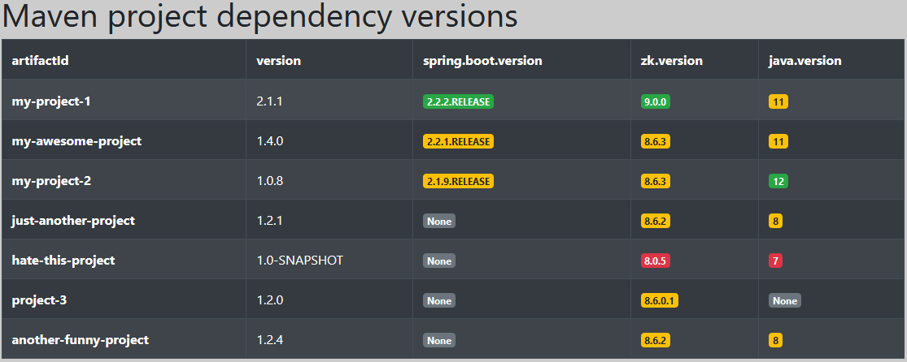

# Maven dependency extractor

Simple **Python** program that parses **Maven** POM files to build a table of dependency versions.


---

# Table of Contents

* [About the Project](#about-the-project)
* [Prerequisites](#prerequisites)
* [Usage](#usage)
* [Output](#output)
* [License](#license)

# About the Project

<table>
  <tr>
    <td>
        
    </td>
    <td>
      
    </td>
    <td>
      
    </td>
  </tr>
</table>

This project simply consists of a very basic **Python** program that parses multiple remote **Maven** projects (POM files)
to extract versions of some dependencies and build a summary table.

It is very basic and was just intended to help me visualize the main dependencies of my Maven projects in a single view,
of course it would need a lot of refactoring and improvements to be a real production tool.

# Prerequisites

POM files must be valid POM format and contains the namespace `http://maven.apache.org/POM/4.0.0`.

You must have `<artifactId>` and `<version>` nodes under your `<project>` node.

All dependencies versions should be inside a `<properties>` node.

Example :

```xml
<project xmlns="http://maven.apache.org/POM/4.0.0">
    <artifactId>my-project</artifactId>
    <version>2.1.1</version>

    <properties>
        <spring.boot.version>2.2.2.RELEASE</spring.boot.version>
        <zk.version>9.0.0</zk.version>
        <commons-lang3.version>3.9</commons-lang3.version>
        ...
    </properties>

    ...

</project>
```

# Usage

In the `read_pom.py` file :
1. Modify `repositories_list` variable to include your repositories
2. Modify `dependencies_versions_list` variable to include your artifact ids and versions (for each dependency you can set latest version and a minimum required version) 
3. Modify `authentication_data` variable to include your credentials to connect to your repositories

Then simply run the `read_pom.py` file.

# Output

It generates an HTML file in the project directory named `versions.html`.

For each dependency, the version will be display as a badge with the right color :
- :green_circle: green if dependency is up-to-date (latest version)
- :orange_circle: orange if dependency is not up-to-date but meets the minimum required version
- :red_circle: red if dependency is out of date (does not even meet the minimum required version)

Here is an example output :



# License

[General Public License (GPL) v3](https://www.gnu.org/licenses/gpl-3.0.en.html)

This program is free software: you can redistribute it and/or modify it under the terms of the GNU
General Public License as published by the Free Software Foundation, either version 3 of the
License, or (at your option) any later version.

This program is distributed in the hope that it will be useful, but WITHOUT ANY WARRANTY; without
even the implied warranty of MERCHANTABILITY or FITNESS FOR A PARTICULAR PURPOSE. See the GNU
General Public License for more details.
    
You should have received a copy of the GNU General Public License along with this program.  If not,
see <http://www.gnu.org/licenses/>.